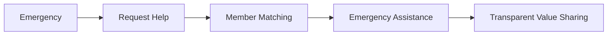

# QuickAid Collective

<p align="center">
  <strong>Emergency care, owned by the people who deliver it.</strong>
</p>

<p align="center">
  A community-powered emergency assistance platform built around coordination, transparency, and shared ownership.
</p>

<p align="center">
  <a href="https://quickaid-collective-mk4x.bolt.host">
    <strong>🌐 Live Prototype</strong>
  </a>
</p>

---

## Overview

**QuickAid Collective** is a proposed emergency-assistance platform designed to simplify coordination during accidents and medical emergencies.

Instead of making people manage emergency calls, location sharing, trusted contacts, medical information, and nearby assistance separately, QuickAid brings these elements into one coordinated flow.

The platform is built around a second idea:

> **The people who deliver the value should have a meaningful stake in the network that creates it.**

QuickAid Collective therefore explores a **member-owned model** where participating responders, ambulance operators, paramedics, technicians, and other eligible frontline service providers can participate in governance and share in the value they create.

---

## The Problem

During an emergency, the first few minutes can become chaotic.

A person or bystander may need to:

- Contact emergency services
- Share their location
- Inform family or trusted contacts
- Provide medical information
- Find nearby assistance
- Decide what immediate action to take

These tasks are often fragmented across different calls, applications, and conversations.

At the same time, the people providing frontline assistance may have limited control over the digital platforms that connect them with people who need their services.

**QuickAid Collective addresses both sides of this coordination gap.**

---

## The Idea

QuickAid Collective connects people requesting emergency assistance with nearby participating members while keeping the emergency workflow simple.

### 🔄 Core flow

```text
Emergency
    ↓
Request Help
    ↓
Share Location & Details
    ↓
Match Nearby Help
    ↓
Provide Assistance
    ↓
Transparent Value Sharing
```



## 🔄 How It Works

```text
Emergency Occurs
       ↓
User Requests Help
       ↓
Location & Emergency Details
       ↓
Nearby Member Matching
       ↓
Responder Provides Assistance
       ↓
Transparent Service & Value Sharing
```
## Published link
```
[](https://bolt.new/~/sb1-qzvtxnp3)
